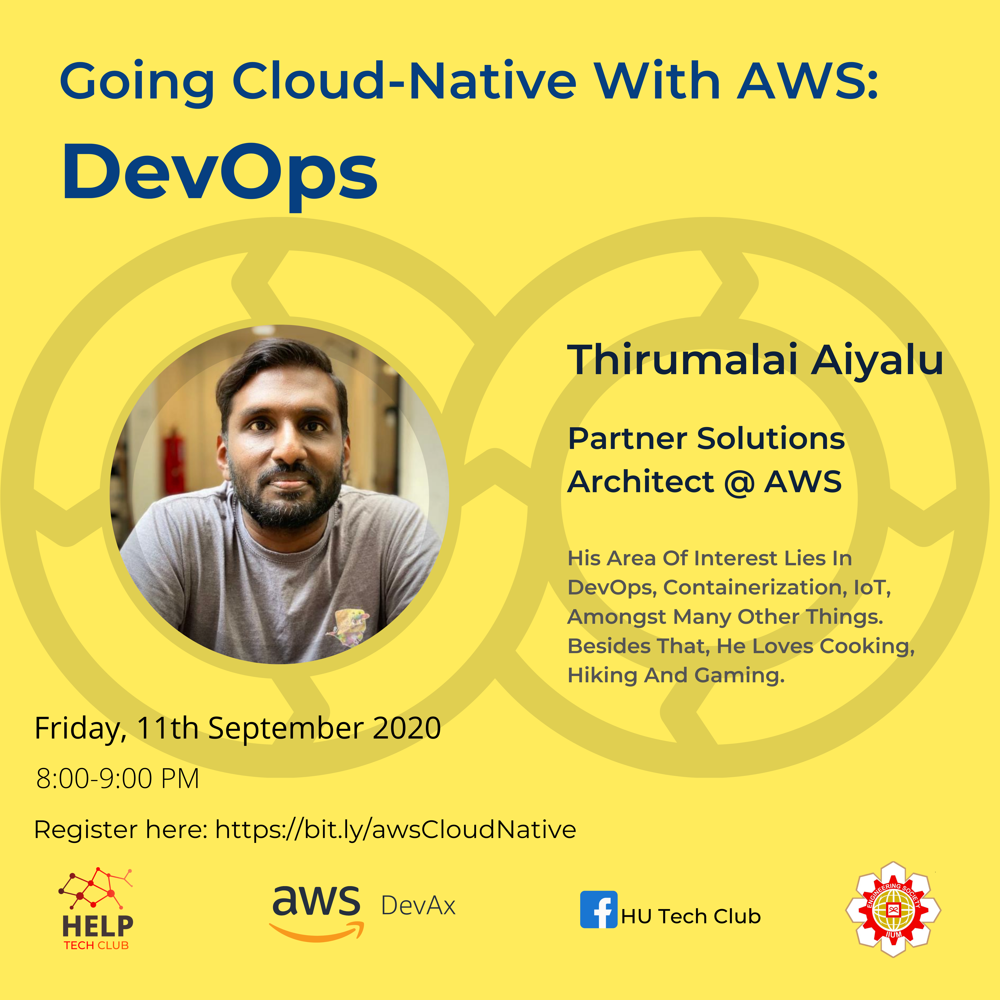

# Going Cloud Native

## Cloud Infrastructure

(Click on the image for the Youtube video.)

## Networking

(Click on the image for the Youtube video.)

## Storage

(Click on the image for the Youtube video.)

## Databases

(Click on the image for the Youtube video.)

## Security

(Click on the image for the Youtube video.)

[Slides](https://docs.google.com/presentation/d/1HwYGnU1tFdLTkRdFiaNT5WTVdRtZNNchQPlpqTHI49U/edit#slide=id.g4fd749874b_1_0)

## DevOps

(Click on the image for the Youtube video.)

## Containers

(Click on the image for the Youtube video.)

## Serverless

(Click on the image for the Youtube video.)

## Data Engineering

## AI/ML

## Serverless Security
